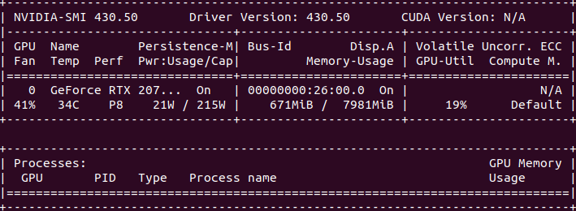

# keras-tools
Description: Repo for tools developed to help with deep learning with Keras. Also contains info on how to make sure
 you are up and running with Docker + Nvidia GPUs

## Tips for ensuring Docker is setup to use Nvidia GPU
1. Install Docker using the instructions found here (Ubuntu): https://docs.docker.com/engine/install/ubuntu/#installation-methods
2. Install Nvidia container runtime packages
    1. Visit https://nvidia.github.io/nvidia-container-runtime/ and follow the instructions for your installation to
     add the Nvidia repos
    2. Visit https://docs.docker.com/config/containers/resource_constraints/#access-an-nvidia-gpu and follow these
     instructions to get the runtime environment installed
    3. Restart Docker `systemctl restart docker` on Ubuntu systems
3. Ensure the above worked by running `sudo docker run -it --rm --gpus all ubuntu nvidia-smi` which should output
 something like this: 
 
 
    